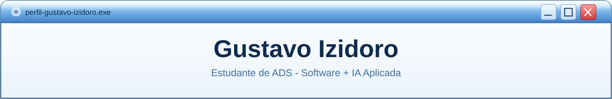
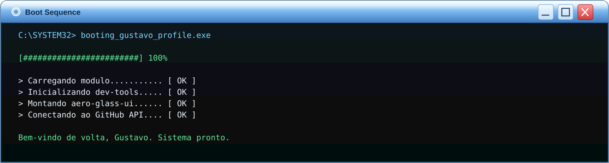

<!-- ===================== BANNER — JANELA PRINCIPAL ===================== -->

 

<!-- ===================== TYPING ANIMATION ===================== -->

  

<!-- ===================== TERMINAL DE BOOT ===================== -->

 

 

<!-- ===================== SOBRE MIM ===================== -->

 

| Campo | Detalhe |
|:--|:--|
| **Formação** | Análise e Desenvolvimento de Sistemas — 4º período, curso noturno |
| **Foco atual** | Desenvolvimento de software com apoio de IA no processo |
| **Situação** | Em busca de estágio na área de desenvolvimento de software |
| **Python** | Fundamentos sólidos, praticando algoritmos no Beecrowd e HackerRank |
| **React** | Componentes, JSX, props, useState, useEffect, consumo de API |
| **Metodologia** | Estudando Spec-Driven Development — specs, skills e planejamento antes de codar |
| **Versionamento** | Git e GitHub, com commits diários |

 

 

<!-- ===================== TECH STACK ===================== -->

 

  

 

 

 

<!-- ===================== PROJETOS ===================== -->

 

<table>
<tr>
<td width="50%">

### TarefasExpress
Aplicação de gerenciamento de tarefas rápida e direta para organizar o dia a dia.

`JavaScript` `HTML` `CSS`

</td>
<td width="50%">

### VisuCard
Plataforma web com autenticação, busca de profissionais, contratações, portfólio e dashboard de usuário.

`PHP` `MySQL` `JavaScript`

</td>
</tr>
<tr>
<td width="50%">

### Vendas-Produtos-Native
Aplicativo mobile para gestão e vendas de produtos, com React Native e TypeScript.

`TypeScript` `React Native`

</td>
<td width="50%">

### AgendasBarber
Sistema de agendamento pensado para barbearias, com interface simples para marcar horários.

`HTML` `CSS` `JavaScript`

</td>
</tr>
</table>

 

 

<!-- ===================== RODAPÉ ===================== -->

  

Feito com código e um toque de nostalgia Aero

